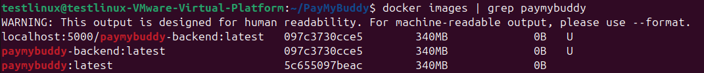
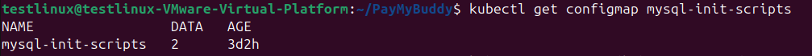
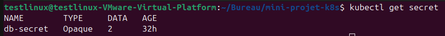
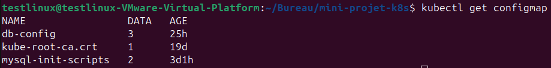
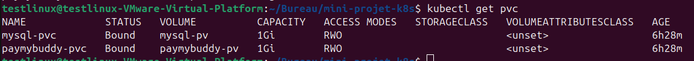
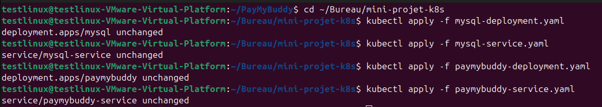
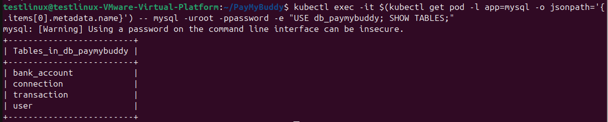

# Mini-projet Kubernetes — Déploiement de PayMyBuddy

## Description

Déploiement de l'application Spring Boot **PayMyBuddy** sur un cluster Kubernetes (Minikube) à l'aide de manifests YAML.

L'architecture déployée comprend :
- Un **backend Spring Boot** (PayMyBuddy)
- Une **base de données MySQL**, initialisée automatiquement avec ses tables
- Des **Services Kubernetes** pour la communication interne et l'exposition externe
- Des **Secrets** et **ConfigMaps** pour séparer les données sensibles des données de configuration
- Des **PersistentVolume / PersistentVolumeClaim** pour la persistance des données
- Un **readinessProbe** sur MySQL pour éviter les erreurs de connexion prématurées de PayMyBuddy

> Ce projet a été réalisé sans Helm, en écrivant manuellement les manifests YAML afin de mieux comprendre les mécanismes internes de Kubernetes.

---

## Environnement

| Composant | Version |
|-----------|---------|
| OS | Ubuntu 25.04 (VM VMware) |
| Minikube | v1.38.1 |
| Kubernetes | v1.35.1 |
| kubectl | v1.36.1 |
| Docker | 29.2.1 |

---

## Architecture déployée

```
INTERNET
    │
    ▼
NodePort (port 30080)
    │
    ▼
Service PayMyBuddy (ClusterIP — port 8080)
    │
    ▼
Pod PayMyBuddy ────────▶ Service MySQL (ClusterIP — port 3306)
    │                            │
    ▼                            ▼
PVC paymybuddy-pvc          Pod MySQL (readinessProbe actif)
    │                            │
    ▼                            ▼
PV paymybuddy-pv             PVC mysql-pvc
(/data/paymybuddy)                │
                                   ▼
                              PV mysql-pv
                              (/data/mysql)

Secrets (db-secret) et ConfigMaps (db-config, mysql-init-scripts)
injectés dans les deux Deployments
```

---

## Structure du projet

```
mini-projet-k8s/
├── mysql-deployment.yaml             # Deployment MySQL (1 réplica, readinessProbe, PVC)
├── mysql-service.yaml                # Service ClusterIP pour MySQL
├── paymybuddy-deployment.yaml        # Deployment PayMyBuddy (Secrets/ConfigMaps, PVC)
├── paymybuddy-service.yaml           # Service NodePort pour exposer PayMyBuddy
├── persistent-volumes.yaml           # PV pour MySQL et PayMyBuddy
├── persistent-volume-claims.yaml     # PVC pour MySQL et PayMyBuddy
└── screenshots/
    ├── docker-images-paymybuddy.png
    ├── kubectl-get-configmap-init.png
    ├── kubectl-get-secret.png
    ├── kubectl-get-configmap.png
    ├── kubectl-get-pvc.png
    ├── kubectl-apply-all.png
    ├── kubectl-get-pods.png
    ├── kubectl-get-all.png
    ├── show-tables.png
    └── app-login.png
```

---

## Pourquoi on a dû construire l'image Docker manuellement

Le sujet original fait référence à l'image `eazytraining/paymybuddy` sur Docker Hub.
Cette image n'est plus disponible (les images non maintenues finissent par être
retirées de Docker Hub sur les comptes gratuits).

Pour contourner ce problème, l'image a été reconstruite manuellement depuis le
code source du repo officiel du formateur : https://github.com/eazytraining/PayMyBuddy

Le flag `imagePullPolicy: Never` a été ajouté dans le manifest pour indiquer
à Kubernetes d'utiliser l'image locale sans chercher sur Docker Hub.

---

## Pourquoi la base de données est initialisée via un ConfigMap

Une base MySQL vide ne contient aucune table. PayMyBuddy a besoin des tables
`user`, `bank_account`, `connection` et `transaction` pour fonctionner.

Les scripts SQL du projet (`create.sql` et `data.sql`, situés dans
`src/main/resources/database` du repo PayMyBuddy) sont transformés en
ConfigMap, puis montés dans `/docker-entrypoint-initdb.d/` du conteneur MySQL.
L'image officielle MySQL exécute automatiquement tout script présent dans ce
dossier lors du tout premier démarrage (base de données vide).

---

## Prérequis

- Docker installé et fonctionnel
- Minikube installé
- kubectl installé
- Java 17 + Maven (pour construire l'image PayMyBuddy)

---

## Étape 1 — Démarrer le cluster Kubernetes

```bash
minikube start --driver=docker
```

Vérifier que le cluster est opérationnel :

```bash
kubectl get nodes
```

R�sultat attendu :
```
NAME       STATUS   ROLES           AGE   VERSION
minikube   Ready    control-plane   Xm    v1.35.1
```

---

## Étape 2 — Construire et charger l'image PayMyBuddy

```bash
git clone https://github.com/eazytraining/PayMyBuddy.git
cd PayMyBuddy

# Compiler le code Java avec Maven (produit target/paymybuddy.jar)
mvn clean install -DskipTests

# Construire l'image Docker à partir du Dockerfile du projet
docker build -t paymybuddy:latest .

# Charger l'image dans Minikube (sans passer par un registry)
minikube image load paymybuddy:latest
```

Vérifier que l'image est bien présente localement :

```bash
docker images | grep paymybuddy
```

### Image Docker construite localement


```bash
cd ~
```

---

## Étape 3 — Récupérer les scripts SQL et créer le ConfigMap d'initialisation

```bash
cd ~/PayMyBuddy/src/main/resources/database
ls
# create.sql  data.sql

kubectl create configmap mysql-init-scripts \
  --from-file=create.sql \
  --from-file=data.sql
```

Vérifier :
```bash
kubectl get configmap mysql-init-scripts
```

### ConfigMap des scripts d'initialisation SQL


---

## Étape 4 — Créer le Secret et le ConfigMap applicatifs

**Secret** (données sensibles — mots de passe) :
```bash
kubectl create secret generic db-secret \
  --from-literal=mysql-root-password=password \
  --from-literal=spring-datasource-password=password
```

**ConfigMap** (données non sensibles — nom de base, username, URL JDBC) :
```bash
kubectl create configmap db-config \
  --from-literal=mysql-database=db_paymybuddy \
  --from-literal=spring-datasource-username=root \
  --from-literal=spring-datasource-url=jdbc:mysql://mysql-service:3306/db_paymybuddy
```

Vérifier :
```bash
kubectl get secret db-secret
kubectl get configmap db-config
```

### Secret applicatif


### ConfigMap applicatif


---

## Étape 5 — Cloner ce repo et se placer dans le dossier

```bash
git clone https://github.com/Marvin-Git-Project/mini-projet-kubernetes.git
cd mini-projet-kubernetes
```

---

## Étape 6 — Créer les volumes persistants (PV et PVC)

```bash
kubectl apply -f persistent-volumes.yaml
kubectl apply -f persistent-volume-claims.yaml
```

Vérifier que les PVC sont bien `Bound` à nos PV :
```bash
kubectl get pv
kubectl get pvc
```

### Volumes persistants (PVC liés aux PV)


---

## Étape 7 — Déployer MySQL et PayMyBuddy

```bash
# MySQL
kubectl apply -f mysql-deployment.yaml
kubectl apply -f mysql-service.yaml

# PayMyBuddy
kubectl apply -f paymybuddy-deployment.yaml
kubectl apply -f paymybuddy-service.yaml
```

### Application des manifests


> Le statut `unchanged` indique que Kubernetes a comparé chaque fichier YAML
> à l'état actuel du cluster et qu'aucune différence n'a été détectée — preuve
> que le déploiement est stable et cohérent avec les manifests du repo.
> Lors d'un premier déploiement, le statut affiché sera `created`.

---

## Étape 8 — Vérifier le déploiement

Pods :
```bash
kubectl get pods
```

### Pods en cours d'exécution


Vue complète du cluster :
```bash
kubectl get all
```

### Vue complète du cluster (pods, services, deployments, replicasets)


Vérifier que les tables MySQL ont bien été créées par le ConfigMap d'init :
```bash
kubectl exec -it $(kubectl get pod -l app=mysql -o jsonpath='{.items[0].metadata.name}') -- \
  mysql -uroot -ppassword -e "USE db_paymybuddy; SHOW TABLES;"
```

### Tables créées automatiquement dans MySQL


---

## Étape 9 — Accéder à l'application

```bash
minikube service paymybuddy-service --url
```

Ouvrir l'URL affichée dans le navigateur. L'application est accessible sur le port **30080**.

### Interface de l'application (login)


---

## Après un redémarrage de la VM

Minikube et les pods s'arrêtent quand la VM est éteinte.

```bash
# 1. Relancer Minikube
minikube start --driver=docker

# 2. Vérifier que les pods redémarrent automatiquement
kubectl get pods
```

> Si un pod MySQL reste en `CrashLoopBackOff` avec l'erreur
> `--initialize specified but the data directory has files in it`,
> cela signifie que le volume persistant contient déjà des données
> dans un état incohérent. Dans le cadre de ce projet de test, la solution
> a été de vider le dossier concerné sur le nœud Minikube :
> ```bash
> minikube ssh
> sudo rm -rf /data/mysql
> sudo mkdir -p /data/mysql
> exit
> kubectl delete pod -l app=mysql
> ```
> Les tables sont recréées automatiquement par le ConfigMap d'initialisation
> au redémarrage suivant.

Si les pods ne redémarrent pas automatiquement, réappliquer les manifests :
```bash
kubectl apply -f mysql-deployment.yaml
kubectl apply -f mysql-service.yaml
kubectl apply -f paymybuddy-deployment.yaml
kubectl apply -f paymybuddy-service.yaml
```

Recharger l'image locale si nécessaire (uniquement après un `minikube delete`) :
```bash
cd ~/PayMyBuddy
minikube image load paymybuddy:latest
```

Recupérer l'URL de l'application :
```bash
minikube service paymybuddy-service --url
```

---

## Bonnes pratiques mises en place

| Bonne pratique | Implémentation |
|----------------|-----------------|
| Séparation des données sensibles | `Secret db-secret` pour les mots de passe |
| Séparation de la configuration | `ConfigMap db-config` pour le reste des variables |
| Initialisation automatique de la BDD | `ConfigMap mysql-init-scripts` monté dans `/docker-entrypoint-initdb.d` |
| Disponibilité fiable de MySQL | `readinessProbe` (`mysqladmin ping`) avant d'accepter du trafic |
| Persistance des données | `PersistentVolume` + `PersistentVolumeClaim` (au lieu d'un `hostPath` direct) |

---

## Commandes utiles

| Action | Commande |
|--------|----------|
| Voir tous les pods | `kubectl get pods` |
| Voir les volumes persistants | `kubectl get pv` / `kubectl get pvc` |
| Voir les secrets / configmaps | `kubectl get secret` / `kubectl get configmap` |
| Vue complète du cluster | `kubectl get all` |
| Logs d'un pod | `kubectl logs <nom-du-pod>` |
| Détails d'un pod | `kubectl describe pod <nom-du-pod>` |
| Supprimer un déploiement | `kubectl delete -f <fichier.yaml>` |
| Arrêter Minikube | `minikube stop` |
| Redémarrer Minikube | `minikube start --driver=docker` |

---

## Auteur

Projet réalisé par **Marvin-Git-Project**
Dans le cadre d'un bootcamp proposé par **Eazytraining**
