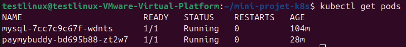
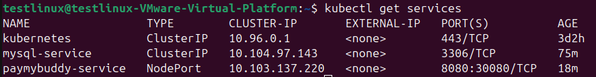
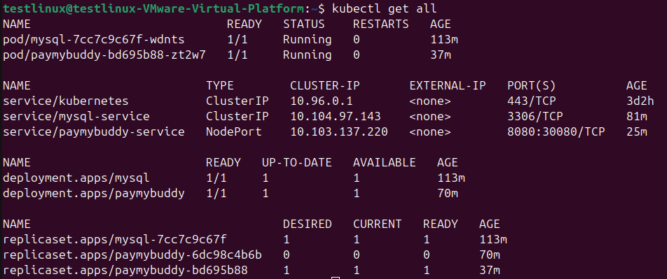
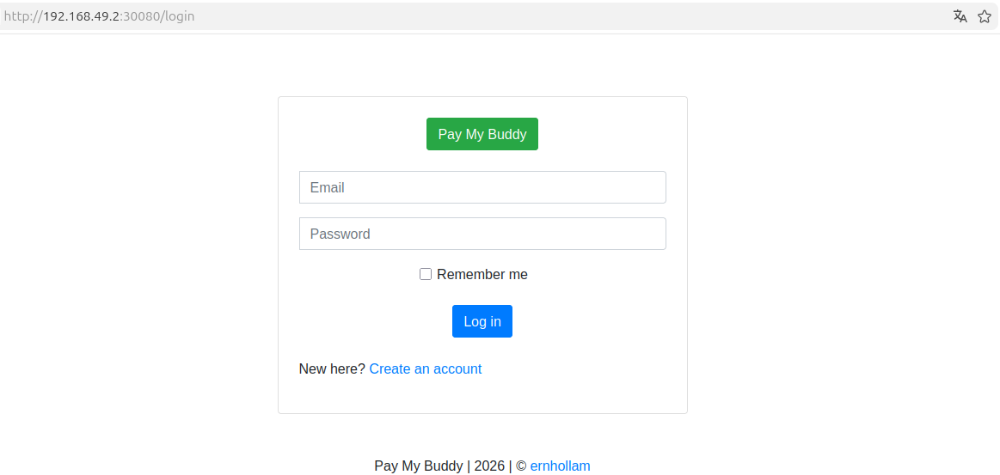

# Mini-projet Kubernetes — Déploiement de PayMyBuddy

## Description

Déploiement de l'application Spring Boot **PayMyBuddy** sur un cluster Kubernetes (Minikube) à l'aide de manifests YAML.

L'objectif est de déployer une architecture complète composée de :
- Un **backend Spring Boot** (PayMyBuddy)
- Une **base de données MySQL**
- Des **services Kubernetes** pour la communication interne et l'exposition externe
- Un **volume persistant** pour conserver les données MySQL

> Ce projet a été réalisé sans Helm, en écrivant manuellement les manifests YAML afin de mieux comprendre les mécanismes internes de Kubernetes.

---

## Environnement

| Composant | Version |
|-----------|---------|
| OS | Ubuntu 25.04 (VM VMware) |
| Minikube | v1.38.1 |
| Kubernetes | v1.35.1 |
| kubectl | v1.36.1 |
| Docker | 29.2.1 |

---

## Architecture déployée

```
INTERNET
    │
    ▼
NodePort (port 30080)
    │
    ▼
Service PayMyBuddy (ClusterIP — port 8080)
    │
    ▼
Pod PayMyBuddy  ──────▶  Service MySQL (ClusterIP — port 3306)
                                    │
                                    ▼
                               Pod MySQL
                                    │
                                    ▼
                          Volume hostPath (/data sur le nœud)
```

---

## Structure du projet

```
mini-projet-k8s/
├── mysql-deployment.yaml        # Deployment MySQL (1 réplica)
├── mysql-service.yaml           # Service ClusterIP pour MySQL
├── paymybuddy-deployment.yaml   # Deployment PayMyBuddy avec variables d'env
├── paymybuddy-service.yaml      # Service NodePort pour exposer PayMyBuddy
└── screenshots/
    ├── kubectl-get-pods.png
    ├── kubectl-get-services.png
    ├── kubectl-get-all.png
    ├── app-login.png
    └── ls-projet.png
```

---

## Pourquoi on a dû construire l'image Docker manuellement

Le sujet original fait référence à l'image `eazytraining/paymybuddy` sur Docker Hub.
Cette image n'est/n'était plus disponible (peut être lié à Docker Hub).

Pour contourner ce problème, l'image a été reconstruite manuellement depuis le
code source du repo officiel du formateur :
Voir -> https://github.com/eazytraining/PayMyBuddy

```bash
# 1. Cloner le repo officiel
git clone https://github.com/eazytraining/PayMyBuddy.git
cd PayMyBuddy

# 2. Compiler le code Java avec Maven
mvn clean install -DskipTests

# 3. Construire l'image Docker
docker build -t paymybuddy:latest .

# 4. Charger l'image dans Minikube
minikube image load paymybuddy:latest
```

Le flag `imagePullPolicy: Never` a été ajouté dans le manifest pour indiquer
à Kubernetes d'utiliser l'image locale sans chercher sur Docker Hub.

---

## Prérequis

- Docker installé et fonctionnel
- Minikube installé
- kubectl installé
- Java 17 + Maven (pour construire l'image)

---

## Étape 1 — Démarrer le cluster Kubernetes

```bash
minikube start --driver=docker
```

Vérifier que le cluster est opérationnel :

```bash
kubectl get nodes
```

Résultat attendu :
```
NAME       STATUS   ROLES           AGE   VERSION
minikube   Ready    control-plane   Xm    v1.35.1
```

---

## Étape 2 — Construire et charger l'image PayMyBuddy

```bash
git clone https://github.com/eazytraining/PayMyBuddy.git
cd PayMyBuddy
mvn clean install -DskipTests
docker build -t paymybuddy:latest .
minikube image load paymybuddy:latest
cd ~
```

---

## Étape 3 — Déployer les manifests

Cloner ce repo et se placer dans le dossier :

```bash
git clone https://github.com/Marvin-Git-Project/mini-projet-kubernetes.git
cd mini-projet-kubernetes
```

Appliquer les manifests dans l'ordre :

```bash
# 1. Déployer MySQL
kubectl apply -f mysql-deployment.yaml
kubectl apply -f mysql-service.yaml

# 2. Déployer PayMyBuddy
kubectl apply -f paymybuddy-deployment.yaml
kubectl apply -f paymybuddy-service.yaml
```

---

## Étape 4 — Vérifier le déploiement

Vérifier que les pods tournent :

```bash
kubectl get pods
```

Résultat attendu :
```
NAME                         READY   STATUS    RESTARTS   AGE
mysql-xxxx                   1/1     Running   0          Xm
paymybuddy-xxxx              1/1     Running   0          Xm
```

Vérifier les services :

```bash
kubectl get services
```

Résultat attendu :
```
NAME                 TYPE        CLUSTER-IP       PORT(S)          AGE
mysql-service        ClusterIP   10.xxx.xxx.xxx   3306/TCP         Xm
paymybuddy-service   NodePort    10.xxx.xxx.xxx   8080:30080/TCP   Xm
```

Vue complète de toutes les ressources :

```bash
kubectl get all
```

---

## Étape 5 — Accéder à l'application

Récupérer l'URL d'accès :

```bash
minikube service paymybuddy-service --url
```

Ouvrir l'URL dans le navigateur. L'application est accessible sur le port **30080**.

---

## Après un redémarrage de la VM

Minikube et les pods s'arrêtent quand la VM est éteinte. Voici les commandes
pour tout relancer dans l'ordre :

```bash
# 1. Relancer Minikube
minikube start --driver=docker

# 2. Vérifier que les pods redémarrent automatiquement
kubectl get pods

# Si les pods sont bien Running, l'application est déjà accessible.
# Sinon, relancer les manifests :
kubectl apply -f ~/mini-projet-k8s/mysql-deployment.yaml
kubectl apply -f ~/mini-projet-k8s/mysql-service.yaml
kubectl apply -f ~/mini-projet-k8s/paymybuddy-deployment.yaml
kubectl apply -f ~/mini-projet-k8s/paymybuddy-service.yaml

# 3. Recharger l'image locale dans Minikube si les pods sont en ImagePullBackOff
cd ~/PayMyBuddy
minikube image load paymybuddy:latest

# 4. Récupérer l'URL de l'application
minikube service paymybuddy-service --url
```

> Les pods redémarrent généralement automatiquement après `minikube start`.
> L'étape de rechargement de l'image n'est nécessaire que si Minikube a été
> complètement supprimé avec `minikube delete`.

---

## Captures d'écran

### Pods en cours d'exécution


### Services déployés


### Vue complète du cluster


### Interface de l'application (login)


---

## Commandes utiles

| Action | Commande |
|--------|----------|
| Voir tous les pods | `kubectl get pods` |
| Voir tous les services | `kubectl get services` |
| Vue complète du cluster | `kubectl get all` |
| Logs d'un pod | `kubectl logs <nom-du-pod>` |
| Détails d'un pod | `kubectl describe pod <nom-du-pod>` |
| Supprimer un déploiement | `kubectl delete -f <fichier.yaml>` |
| Arrêter Minikube | `minikube stop` |
| Redémarrer Minikube | `minikube start --driver=docker` |

---

## Auteur

Projet réalisé par **Marvin-Git-Project**
Dans le cadre d'un bootcamp proposé par **Eazytraining**
